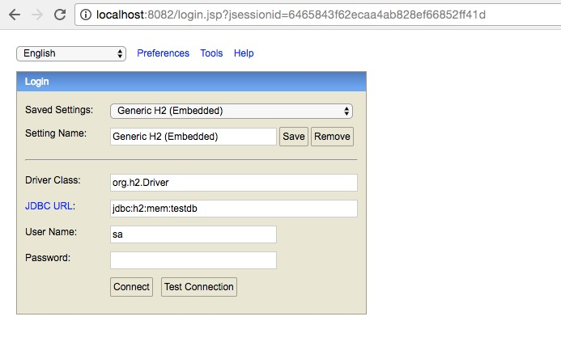

# 项目简介

1. 此商城项目，使用spring cloud 全家桶进行开发

2. 事务处理使用两种:强一致性(TCC),最终一致性(EDA)

## 使用技术

1. java 8 : 使用lambda表达式，简化写法

1. lombok : 简化java bean的写法

1. H2 : 内存式数据库，减少DB依赖 (正式环境时，可以直接切换至MYSQL)

1. spring cloud eureka : 用于服务注册发现

1. spring data jpa : 数据库底层连接技术

1. spring mvc : 访问控制层技术

1. spring cloud robbin : 使用客户端负载均衡，进行服务提供者的调用

1. spring cloud feign : 分装了ribbon的使用，直接使用注解的方式，进行调用

1. spring boot actuate : spring boot项目的健康检查，此项目整合了应用服务的健康状态

## 项目分级

### 业务分级

此项目分为四个核心模块:

1. 用户模块(user-service):

1. 积分模块(score-service):

1. 产品模块(product-service):

1. 订单模块(order-service):

1. 账户模块(account-service):

### 核心模块分层:

{模块名}-service-api: 微服务的模块api定义

{模块名}-service-core: 微服务的模块业务逻辑实现

{模块名}-service-db: 微服务的模块仓库

## 事务处理:

## h2数据库的查看:

### 查看h2数据库信息:

开启debug日志:

    logging:
      level:
       org:
        hibernate: DEBUG

查找到数据库访问信息 :

    2018-01-10 13:07:48.928 DEBUG 18694 --- [           main] o.hibernate.jpa.internal.util.LogHelper  : PersistenceUnitInfo [
        name: default
        persistence provider classname: null
        classloader: sun.misc.Launcher$AppClassLoader@14dad5dc
        excludeUnlistedClasses: true
        JTA datasource: null
        Non JTA datasource: org.apache.tomcat.jdbc.pool.DataSource@20ffb8d5{ConnectionPool[defaultAutoCommit=null; defaultReadOnly=null; defaultTransactionIsolation=-1; defaultCatalog=null; driverClassName=org.h2.Driver; maxActive=100; maxIdle=100; minIdle=10; initialSize=10; maxWait=30000; testOnBorrow=true; testOnReturn=false; timeBetweenEvictionRunsMillis=5000; numTestsPerEvictionRun=0; minEvictableIdleTimeMillis=60000; testWhileIdle=false; testOnConnect=false; password=********; url=jdbc:h2:mem:testdb;DB_CLOSE_DELAY=-1;DB_CLOSE_ON_EXIT=FALSE; username=sa; validationQuery=SELECT 1; validationQueryTimeout=-1; validatorClassName=null; validationInterval=3000; accessToUnderlyingConnectionAllowed=true; removeAbandoned=false; removeAbandonedTimeout=60; logAbandoned=false; connectionProperties=null; initSQL=null; jdbcInterceptors=null; jmxEnabled=true; fairQueue=true; useEquals=true; abandonWhenPercentageFull=0; maxAge=0; useLock=false; dataSource=null; dataSourceJNDI=null; suspectTimeout=0; alternateUsernameAllowed=false; commitOnReturn=false; rollbackOnReturn=false; useDisposableConnectionFacade=true; logValidationErrors=false; propagateInterruptState=false; ignoreExceptionOnPreLoad=false; useStatementFacade=true; }
        Transaction type: RESOURCE_LOCAL
        PU root URL: file:/git/shop/user-service/user-service-core/target/classes/
        Shared Cache Mode: UNSPECIFIED
        Validation Mode: AUTO
        Jar files URLs []
        Managed classes names [
            com.tasly.user.db.domain.User]
        Mapping files names []
        Properties []

关键信息: jdbc:h2:mem:testdb
用户名:sa
密码默认为空

### web页面访问h2数据库:

启动任意项目，可以访问http://localhost:8082/,进行h2数据库的操作:

