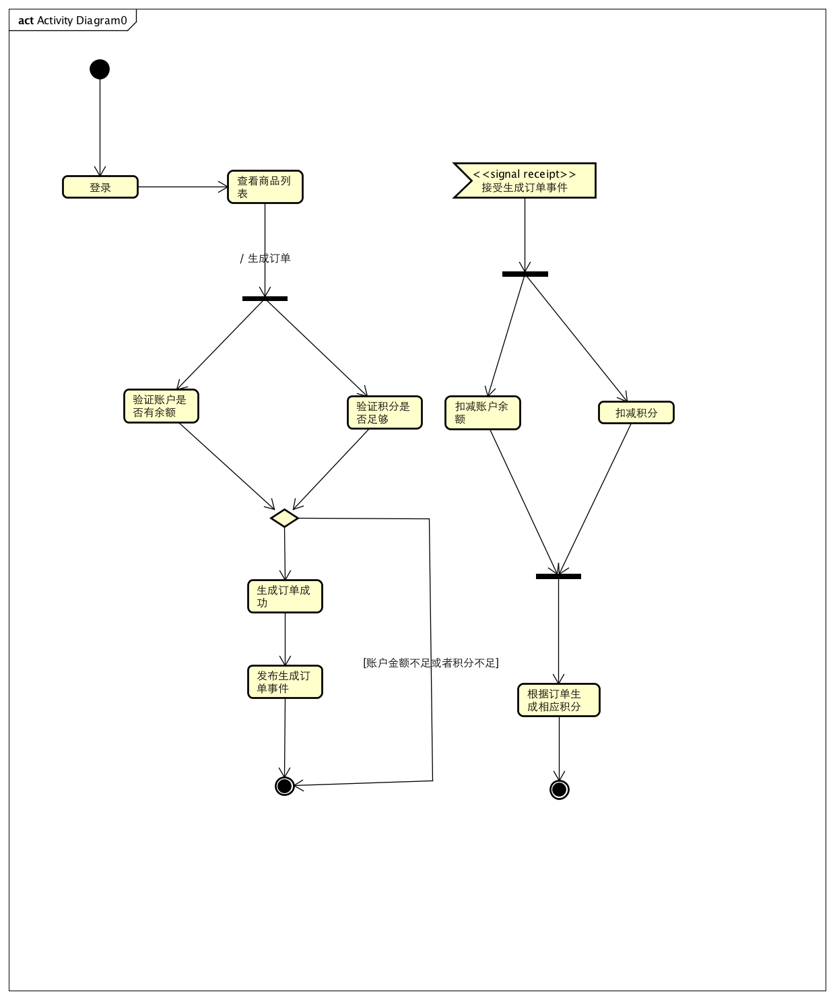

# 项目简介

1. 此商城项目，使用spring cloud 全家桶进行开发

2. 事务处理使用两种:强一致性(TCC),最终一致性(EDA)

## 使用技术

1. java 8 : 使用lambda表达式，简化写法

2. spring cloud eureka : 用于服务注册发现

3. spring data jpa : 数据库底层连接技术

4. spring mvc : 访问控制层技术

5. H2 : 内存式数据库，减少DB依赖 (正式环境时，可以直接切换至MYSQL)

6. lombok : 简化java bean的写法

7. spring cloud robbin : 使用客户端负载均衡，进行服务提供者的调用

8. spring cloud feign : 分装了ribbon的使用，直接使用注解的方式，进行调用

## 项目分级

### 业务分级

此项目分为四个核心模块:

1. 用户模块(user-service):

1. 积分模块(score-service):

1. 产品模块(product-service):

1. 订单模块(order-service):

### 核心模块分层:

{模块名}-service-api: 微服务的模块api定义

{模块名}-service-core: 微服务的模块业务逻辑实现

{模块名}-service-db: 微服务的模块仓库

## 事务处理:

## 下单流程:

